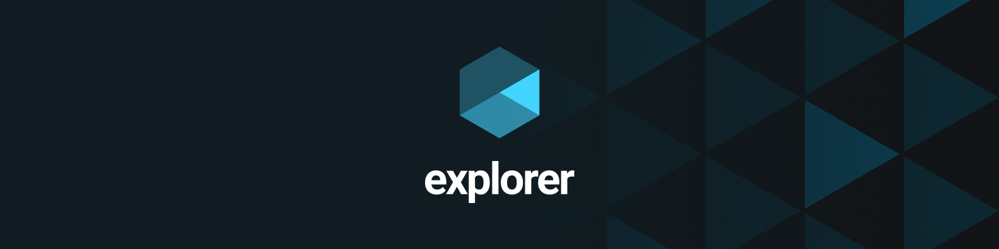
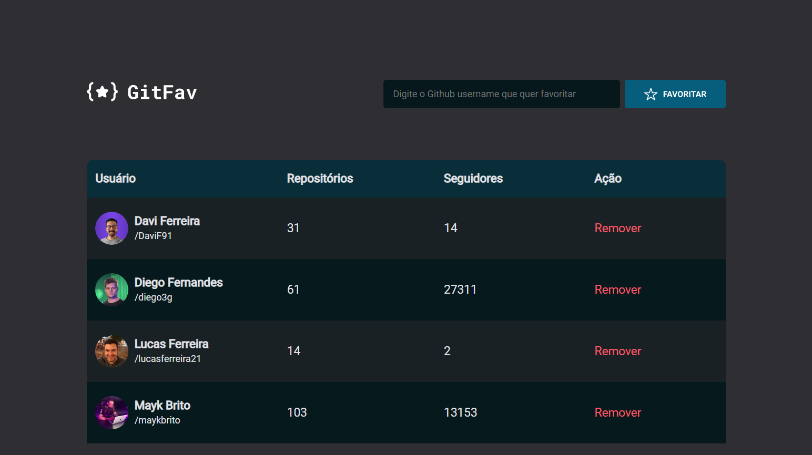
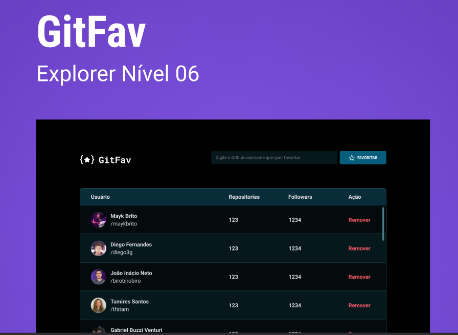

  

 
<h1 align="center"> 
	 Desafio 02 - Git-Fav | Stage 06 🚀 
</h1>

  <a href="https://git-fav-phi.vercel.app/" targert="_blank"> ▶️ Visualizar Página </a>

 

<h2 align=left> 💡​ Info. sobre o projeto </h2>

 Segundo desafio do stage 06 do programa <strong>Explorer</strong> da <a href="https://www.rocketseat.com.br/"> <strong>Rocketseat</strong></a>.

Foi desenvolvido uma aplicação onde permite cadastrar os seus usuários favoritos do Github.
Nesse desafio pude trabalhar com eventos no JavaScript, assincronismo, promises, conceitos de POO como classes, herança e polimorfismo. Também pude trabalhar com conceitos sobre imutabilidade, tratar erros da aplicação utilizando métodos try, catch e throw, utilizar o localStorage e consumir API do Github.

 

<h2 align=left> 🧰​ Tecnologias</h2>

  
  
  
  

 

<h2>🖥️ Git-Fav </h2>

 
<h2> 🖍️ Layout Figma </h2>
<a href="https://www.figma.com/file/EUCBk2qYvZqx7p1s6dviZJ/%5BDesafios-Explorer%5D-GitFav-(Copy)-(Copy)?node-id=104-48&t=ozxOZmKG0MlhVcou-0" targert="_blank"> 
 
 

<h2>​📧​​ Contato </h2>

  
  
   
 

